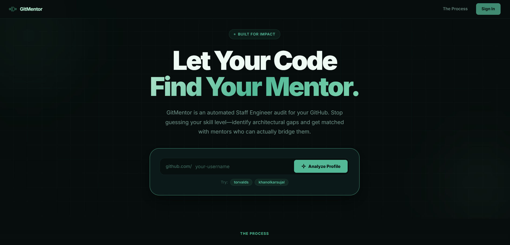

# 🛡️ MentorIQ (GitMentor)

**AI-Powered GitHub Auditing & Mentor Matchmaking Platform**



MentorIQ is a production-ready SaaS application that audits GitHub profiles using AI to assess code maturity, engineering practices, and technical depth. It then intelligently matches developers with high-level industry mentors (from companies like Meta, Google, OpenAI, etc.) based on their specific skill gaps and tech stack.


---

### **🚀 Key Features (Actually Implemented)**
- **🎯 AI Code Auditor**: Uses `Llama-3.3-70b` (via GROQ) to analyze READMEs, file structures, and technology usage.
- **🔬 Deep Skill Analysis**: Generates a weighted **Maturity Score (0-10)** based on Code Quality, Architecture, and Engineering Practices.
- **🤝 Realistic Mentor Match**: Matches you with a database of 25+ industry professionals based on tech-stack overlap and career goals.
- **🛡️ High Availability**: Automatic **HTML Scraper Fallback** if the GitHub API rate-limits the application.
- **✨ Premium UI**: A sleek, glassmorphism-inspired dashboard built with Vanilla CSS for maximum performance and aesthetics.

---

### **🏗️ Project Architecture**
```text
MentorIQ/
├── backend/
│   ├── app/
│   │   ├── api/        # FastAPI Routers (Controllers)
│   │   ├── services/   # Business Logic (AI Audit, GitHub Scraper)
│   │   ├── db/         # SQLite Persistence & Seeding
│   │   ├── core/       # Configuration (Pydantic Settings)
│   │   └── main.py     # Application Entrypoint
│   └── mentors.db      # SQLite Database
├── frontend/
│   ├── index.html      # Main Dashboard
│   ├── script.js       # API Integration & UI Logic
│   └── style.css       # Premium Design System
└── .env                # Global Configuration
```

---

### **🛠️ Quick Start**

#### **1. Setup Environment**
Ensure your `.env` in the root directory contains:
```env
GROQ_API_KEY=your_groq_key_here
GITHUB_TOKEN=optional_but_recommended
```

#### **2. Run the Backend**
```bash
cd backend
python -m app.main
```
The application will be live at [[http://localhost:8000](http://localhost:8000).] (https://mentoriq.onrender.com/)

---

### **🧰 Tech Stack**
- **Backend**: FastAPI, Uvicorn (ASGI)
- **AI**: GROQ (Llama-3.3-70b), OpenAI SDK
- **Database**: SQLite3
- **Scraping**: BeautifulSoup4, Requests
- **Frontend**: Vanilla HTML5, CSS3, JavaScript (ES6+)

---
*Developed by Khanolkar Sujal*
